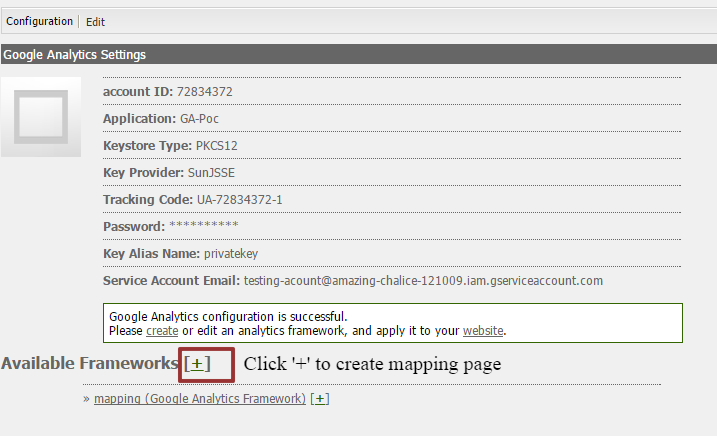

# **Table of content**
* [Purpose of Project](#purpose-of-project)
* [Supported Version](#supported-version)
* [Prerequisite](#prerequisite)
* [Using AEM-GA](#using-aem-ga)
 
## Purpose of Project
The purpose of this project is to make tracking of user activity easy using Google analytics.
The project provides a similar experience as Adobe Analytics.
Developers continue to use AEM’s inbuilt analytics framework while the Siteadmin or super-authors leverage a familiar experience
for mapping Google analytics(GA) dimensions, events etc within AEM.

## Supported Version
* AEM 6.0
* AEM 6.1

## Prerequisite
* To get started with AEM-GA, first we need to create a GA account [Here](https://analytics.google.com/) .
* Create a project on google console website (console.developers.google.com) and enable the Analytics API.
    [More detail on creating a project](https://developers.google.com/identity/sign-in/web/devconsole-project)
* After creating the project you will be redirected to create service account.
    Create a service account and save the private key as .p12 file. [More detail on creating a service account](https://developers.google.com/identity/protocols/OAuth2ServiceAccount)
* On creating a service account, google provides a service account email id which needs to be register on GA for accessing GA features for that project.
* Give permission to this service email id as needed in Google Analytics.
* To register the service account on GA :
    Go to [Google analyitcs](https://analytics.google.com/) and select the account.
    Now go to **admin tab** -> **‘User Management’ section under Account** -> **Enter service account email id** -> **set the permission for this account** -> **click on add**.

## Using AEM-GA
Using AEM-GA is as easy as using sitecatalyst for tracking of user activities.
* __Running :__
    * For AEM 6.0, Install [AEM User 6.0 package](aem-assets/GA-USER-6.0.zip) and [AEM-GA package](aem-assets/aem-ga-content-1.0.zip)
    * For AEM version 6.1, Install [AEM User 6.1 package](aem-assets/GA-USER-6.1.zip) and [AEM-GA package](aem-assets/aem-ga-content-1.0.zip)
        ###### Open googleanalytics page under _etc/cloudservices_ and click on + icon.

        

        ###### Give the configuration page a name and title, select the available template and press 'ok'. Enter the configuration in the opened dialog and press ok.

        

        ###### Add on + to create a mapping page, select available template, give it a name and press 'ok'.

        

        ###### You have created the mapping page where you can map your AEM variables with GA dimensions.

        

        ###### Now go to siteadmin and apply cloud service configuration on the root page of your project.
        That's all the configuration you need to make to track page view
* __Tracking Events :__
    To track user events on a particular component :
    1. Make a node named as ___'analytics'___.
    2. Now add properties named as ___'cq:trackevents'___ and ___'cq:trackvars'___ of type ___'String[]'___ to track _events_ and _variable_ respectively.
    3. Do the mapping of these AEM variables with GA variable and AEM events with GA events in the created mapping page.
    4. Now you can call the javascript method ``gaHandler.record()`` with appropriate parameters.
        For example tracking of image component can be done by calling ``gaHandler.record()`` with parameter like
            ``gaHandler.record({
         event: ['imageClick'],
         values: {
             imageLink:'Link of Image',
             imageAsset:'some value',
             imageTitle:'title of image',
        },
 	},'foundation/components/image')``
